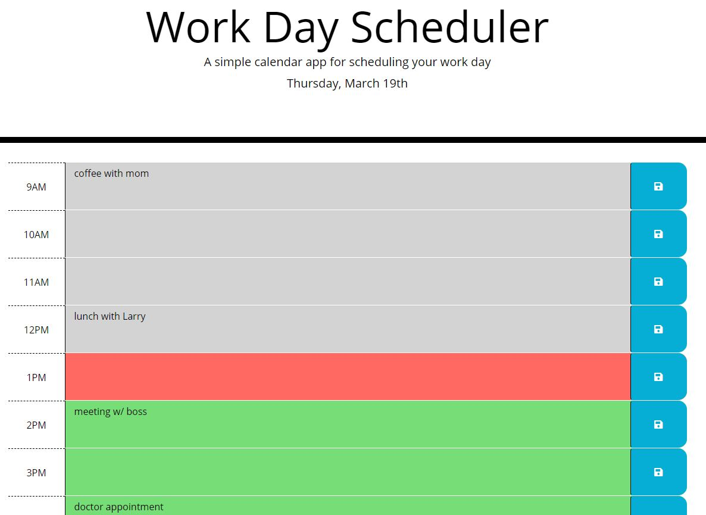

# Day Planner

Day Planner is a simple calendar application that allows the user to save events for each hour of the day.  The app runs in the browser and has dynamically updated HTML and CSS powered by jQuery.  Our app is limited to standard business hours, so the user can enter events between 9 am and 5 pm for each hour.  When the user clicks the save button for that particular hour, the events are saved into local storage so that if the user refreshes the app webpage, they don't lose all their saved events.

Our application colors the time blocks to help the user determine past, present, and future events.  Time blocks in the past are colored gray, the present/current time block is colored red, and future time blocks are colored green.  Our app checks every minute whether the hour has changed to re-color the time blocks, so the user doesn't have to refresh for the colors to update as time passes.

## Links

* Deployed App: https://ryan-harris.github.io/day-planner/
* Github Repo: https://github.com/ryan-harris/day-planner

## Screenshot

